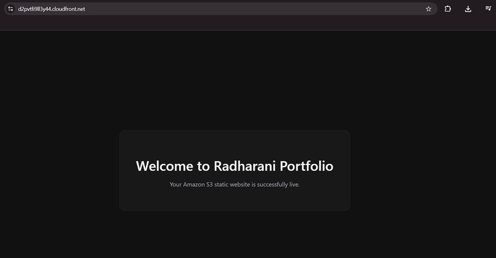
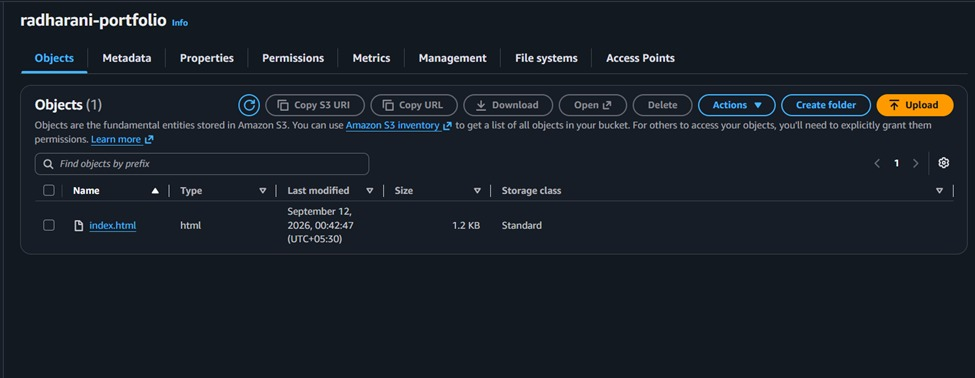

# Static Website Hosting on AWS S3 + CloudFront

A static portfolio website hosted on Amazon S3 and delivered globally via CloudFront CDN with HTTPS enabled.

---

## Live Output

### Website Live on CloudFront


> Site was live at `https://d2pvtfi9ll3y44.cloudfront.net`  
> *(CloudFront distribution disabled after project completion to avoid AWS charges)*

### S3 Bucket with index.html


> Bucket `radharani-portfolio` with `index.html` uploaded (1.2 KB)

---

## Architecture

```
User Request
     ↓
CloudFront CDN (Global Edge Locations)
     ↓
Amazon S3 Bucket (radharani-portfolio)
     ↓
Serves index.html
```

---

## Tech Stack

| Service | Purpose |
|---|---|
| Amazon S3 | Stores and serves static website files |
| AWS CloudFront | CDN for global delivery with HTTPS |
| S3 Bucket Policy | Public read access for website files |

---

## Setup Steps

### 1. Create S3 Bucket
- Bucket name: `radharani-portfolio`
- Region: `ap-south-1` (Mumbai)
- Disabled "Block all public access"

### 2. Enable Static Website Hosting
- S3 → Properties → Static website hosting → Enable
- Index document: `index.html`
- Uploaded `index.html` to bucket

### 3. Bucket Policy for Public Access
```json
{
  "Version": "2012-10-17",
  "Statement": [
    {
      "Sid": "PublicReadGetObject",
      "Effect": "Allow",
      "Principal": "*",
      "Action": "s3:GetObject",
      "Resource": "arn:aws:s3:::radharani-portfolio/*"
    }
  ]
}
```

### 4. CloudFront Distribution
- Origin: S3 static website endpoint
- Viewer Protocol Policy: Redirect HTTP to HTTPS
- Distribution domain: `d2pvtfi9ll3y44.cloudfront.net`

---

## Key Learnings

- Hosted a static website on S3 with public access via bucket policy
- Created a CloudFront distribution for HTTPS and global CDN delivery
- Understood the difference between S3 bucket endpoint and S3 website endpoint as CloudFront origin

---

## Author

**Radha Rani Adepu** · B.Tech CSE (Data Science), HITAM Hyderabad  
[LinkedIn](https://linkedin.com/in/radharaniadepu) · [GitHub](https://github.com/RadhaRani53)
